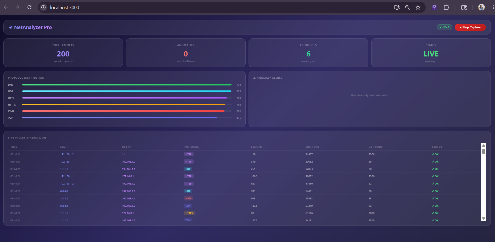

# 🔍 Smart Network Traffic Analyzer

**Real-time network traffic monitoring with ML-powered anomaly detection**

---

## 📌 Overview

A full-stack cybersecurity tool that monitors network traffic in real time, stores packets in MongoDB, detects anomalous behavior using an unsupervised ML model (Isolation Forest), and visualizes everything on a live glassmorphism dashboard.

> Built as a portfolio project demonstrating skills in backend engineering, real-time systems, machine learning, and modern frontend design.

---

## ✨ Features

| Feature | Description |
|---|---|
| 🔴 Live Packet Capture | Real-time packet sniffing via PyShark/tshark |
| 🧠 ML Anomaly Detection | Isolation Forest — no labeled data needed |
| 📊 Live Dashboard | React + glassmorphism UI, updates every 2s |
| 🔒 JWT Authentication | Secure API access with token-based auth |
| 📡 WebSocket Streaming | Flask-SocketIO pushes packets to browser instantly |
| 🗄️ MongoDB Storage | Schema-less packet storage with aggregation analytics |
| 📈 Protocol Analytics | Live protocol distribution with animated bars |
| 👤 Top Talkers | Most active source IPs by traffic volume |
| 📥 CSV Export | Download captured packets as spreadsheet |
| ⚙️ Async Tasks | Celery + Redis for scheduled ML retraining |

---

## 🛠️ Tech Stack

    Frontend   →   React 18, Recharts, Socket.IO Client
    Backend    →   Python 3.12, Flask 3.1, Flask-SocketIO
    Database   →   MongoDB 8.0 (pymongo)
    ML Engine  →   scikit-learn — Isolation Forest
    Auth       →   Flask-JWT-Extended (JWT tokens)
    Queue      →   Celery + Redis
    Capture    →   PyShark (Wireshark/tshark wrapper)

---

## 📁 Project Structure

    smart-network-analyzer/
    ├── backend/
    │   ├── app.py                  # Flask entry point
    │   ├── config.py               # Configuration
    │   ├── api/
    │   │   ├── routes.py           # REST API endpoints
    │   │   └── auth.py             # JWT login
    │   ├── capture/
    │   │   └── packet_capture.py   # Live packet capture
    │   ├── models/
    │   │   └── packet.py           # MongoDB models
    │   ├── ml/
    │   │   └── anomaly_detector.py # Isolation Forest ML
    │   └── tasks/
    │       └── celery_tasks.py     # Background jobs
    └── frontend/
        └── src/
            └── components/
                └── Dashboard.jsx   # Glassmorphism dashboard

---

## 🚀 Getting Started

### Prerequisites
- Python 3.10+
- Node.js 16+
- MongoDB (running on port 27017)

### Backend Setup

    cd backend
    python -m venv venv
    venv\Scripts\activate
    pip install -r requirements.txt
    py app.py

### Frontend Setup

    cd frontend
    npm install
    npm start

Open http://localhost:3000 — click Login then Start Capture

## 🧠 How the ML Works

1. Each packet → 5-feature vector: length, src_port, dst_port, protocol_encoded, ttl
2. Isolation Forest isolates anomalies — rare packets get isolated faster
3. Returns anomaly score — more negative = more suspicious
4. Model retrains every hour on latest 10,000 packets

---

## 📡 API Endpoints

| Method | Endpoint | Description |
|---|---|---|
| POST | /auth/login | Get JWT token |
| POST | /api/capture/start | Start packet capture |
| POST | /api/capture/stop | Stop packet capture |
| GET | /api/packets | Get recent packets |
| GET | /api/analytics/protocols | Protocol distribution |
| GET | /api/export/csv | Download as CSV |

---

## 🔮 Future Improvements

- [ ] GeoIP mapping — world map of traffic
- [ ] Port scan detection
- [ ] Docker Compose deployment
- [ ] Email/Slack alerts on anomalies
- [ ] PCAP file upload for offline analysis

---

## 👩‍💻 Author

**Harshita Soni**
GitHub: [@harshitaasoni22-hs](https://github.com/harshitaasoni22-hs)

---

⭐ Star this repo if you found it useful!

